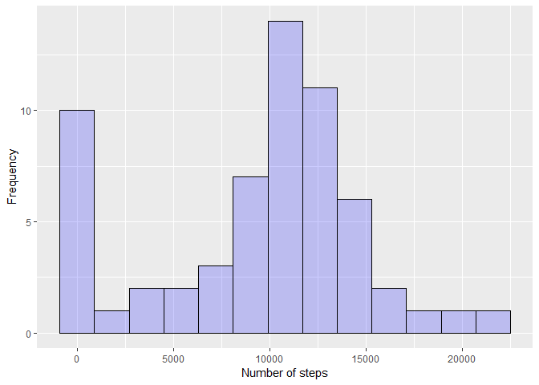
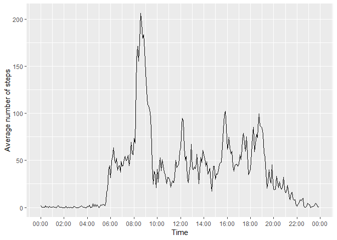
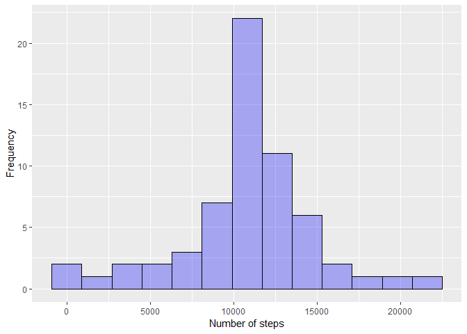
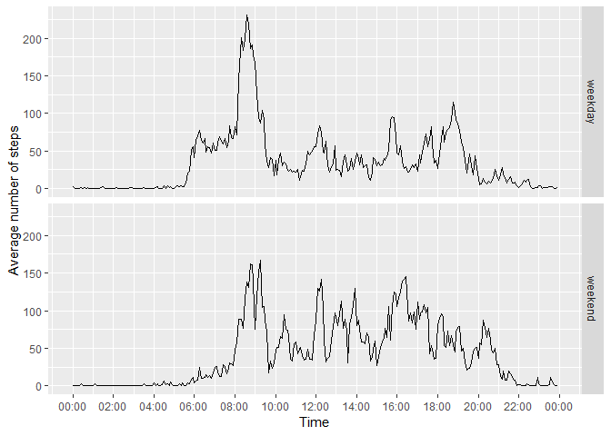

Loading `knitr` and declaring global options

```r
library(knitr)
opts_chunk$set(fig.path='figure/',
               echo=TRUE, warning=FALSE, message=FALSE,
               comment = "")
```

## Loading and preprocessing the data  
1. Loading required packages:  

```r
library(dplyr, warn.conflicts = FALSE)
library(lubridate, warn.conflicts = FALSE)
library(ggplot2)
```

2. Importing the data and converting `date` column to `Date` type.  

```r
data <- read.csv(unz("activity.zip", "activity.csv")) %>%
    as_tibble() %>% mutate(date = as.Date(date, "%Y-%m-%d"))
head(data)
```

```
# A tibble: 6 x 3
  steps date       interval
  <int> <date>        <int>
1    NA 2012-10-01        0
2    NA 2012-10-01        5
3    NA 2012-10-01       10
4    NA 2012-10-01       15
5    NA 2012-10-01       20
6    NA 2012-10-01       25
```

## What is mean total number of steps taken per day?  
1. Calculating the total number of steps taken per day:  

```r
per_day <- tapply(data$steps, data$date, sum, na.rm = TRUE)
head(per_day)
```

```
2012-10-01 2012-10-02 2012-10-03 2012-10-04 2012-10-05 2012-10-06 
         0        126      11352      12116      13294      15420 
```

2. Making a histogram of the total number of steps taken each day:   

```r
qplot(per_day,
      binwidth = 1800,
      xlab = "Number of steps",
      ylab = "Frequency",
      fill = I("blue"),
      col = I("black"),
      alpha = I(.2))
```

<!-- -->

3. Now let's calculate mean and median values of total number of steps taken per day:  

```r
median <- median(per_day)
average <- round(mean(per_day))
```
Mean and median values of total number of steps taken per day are 9354 and 10395, respectively.

## What is the average daily activity pattern?  
1. Making a time series plot of the 5-minute interval and the average number of steps taken, averaged across all days:  
1.1 First, let's group the data by interval identifier, calculate mean value for each group and save it to the  `average` variable:   

```r
by_interval <- group_by(data, interval) %>%
    summarise(average = mean(steps, na.rm = TRUE))
```

1.2 Now we create `t_interval` variable containing time sequence for the x-axis:   

```r
by_interval <- mutate(by_interval,
                     t_interval = seq.POSIXt(as.POSIXct("2012-10-01 00:00:00"),
                                             by = "5 min",
                                             length.out = nrow(by_interval)))
```

1.3 Creating the plot:  

```r
p <- ggplot(by_interval, aes(t_interval, average)) + 
    geom_line() +
    scale_x_datetime(date_labels = "%H:%M",
                     date_breaks = "2 hours") + 
    labs(x = "Time",
         y = "Average number of steps")
plot(p)
```

<!-- -->

2. Which 5-minute interval, on average across all the days in the dataset, contains the maximum number of steps?   

```r
time_to_walk <- with(by_interval, interval[average == max(average)])
```
The maximum number of steps is taken in the time interval identified as 835.

## Imputing missing values  
1. Calculating the total number of missing values in the dataset:   
Since only variable `steps` contais `NA`s, we use it to get the total number of missing values, ...

```r
num_missing <- sum(is.na(data$steps))
```
which is equal to 2304.  

2. Devise a strategy for filling in all of the missing values in the dataset.  
In order to impute missing values, let's use means of number of steps for corresponding 5-minute intervals.  

3. Create a new dataset that is equal to the original dataset but with the missing data filled in.  
We take missing values from the data frame `by_interval` that contains mean values for each 5-minute interval.  

```r
data_full <- data %>% mutate(steps = ifelse(is.na(steps),
                      by_interval$average[match(interval, by_interval$interval)],
                      steps))
```

Let's make sure that all the missing values were imputed:

```r
sum(is.na(data_full$steps))
```

```
[1] 0
```
Looks good.  

4. Making a histogram of the total number of steps taken each day, calculate and report the mean and median total number of steps taken per day.  
4.1 First, let's calculate total number of steps taken per day using full data set and save it to `per_day_full`:  

```r
per_day_full <- tapply(data_full$steps, data_full$date, sum)
```

4.1 Now we use the data to plot the histogram:  

```r
qplot(per_day_full,
      binwidth = 1800,
      xlab = "Number of steps",
      ylab = "Frequency",
      fill = I("blue"),
      col = I("black"),
      alpha = I(.3))
```

<!-- -->

4.2 Calculating mean and median:   

```r
median_full <- as.integer(median(per_day_full))
average_full <- as.integer(mean(per_day_full))
```
Mean and median values are now both equal to 10766.  

As can be seen from the first histogram, there were no data gathered for some number of days. To be precise:

```r
sum(per_day == 0)
```

```
[1] 8
```

So after filling the missing values both, mean and median values of total number of steps taken per day, slightly increased and the shape of the histogram became closer to the shape of normal distribution with the most probable number of steps taken per day between 10k and 11.8k.

## Are there differences in activity patterns between weekdays and weekends?  
1. Creating a new factor variable in the dataset with two levels – “weekday” and “weekend” indicating whether a given date is a weekday or weekend day:  

```r
data_full <- mutate(data_full, type = if_else(wday(date) %in% c(1, 7),
                                              true = "weekend",
                                              false = "weekday")) %>%
    mutate(type = factor(type))
```

Let's check if number of weekend and weekdays make sense:

```r
table(data_full$type)
```

```

weekday weekend 
  12960    4608 
```
Looks sensible.

2. Make a panel plot containing a time series plot of the 5-minute interval and the average number of steps taken, averaged across all weekday days or weekend days. We'll take `t_interval` variable from `by_interval` data frame that contains 5-minute intervals.  

```r
full_summary <- data_full %>%
    group_by(interval, type) %>%
    summarize(average = mean(steps))
g <- ggplot(full_summary,
            aes(rep(by_interval$t_interval,
                    each = 2),
                average)) +
    geom_line() +
    facet_grid(type~.) +
    scale_x_datetime(date_labels = "%H:%M",
                     date_breaks = "2 hours")+
    labs(x = "Time",
         y = "Average number of steps")
plot(g)
```

<!-- -->
